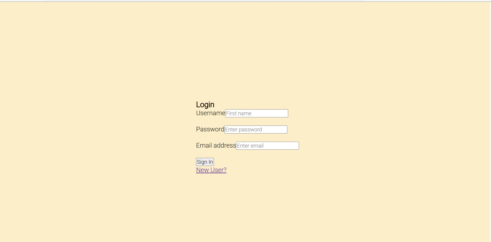
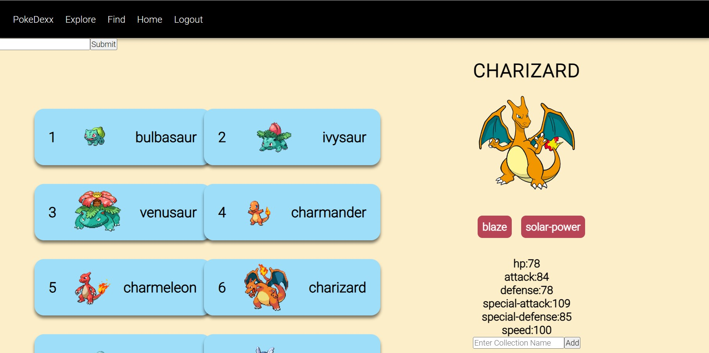
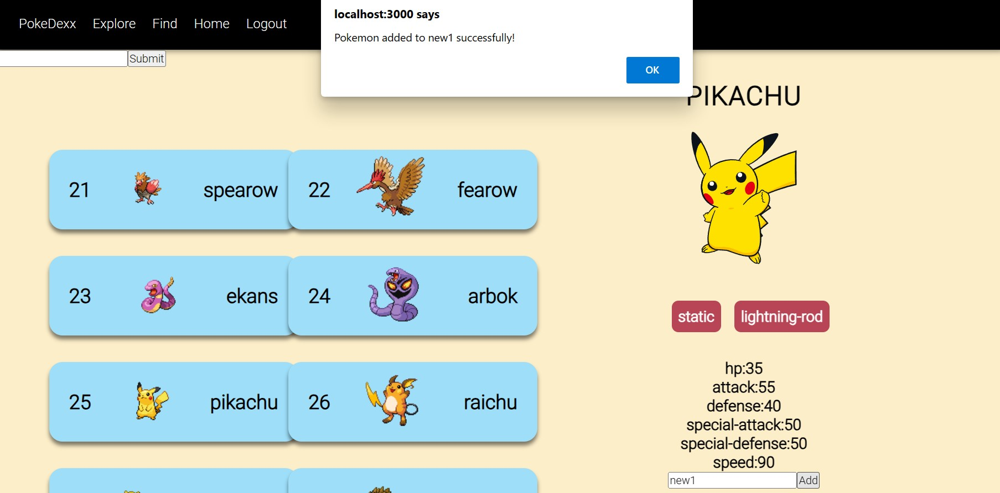
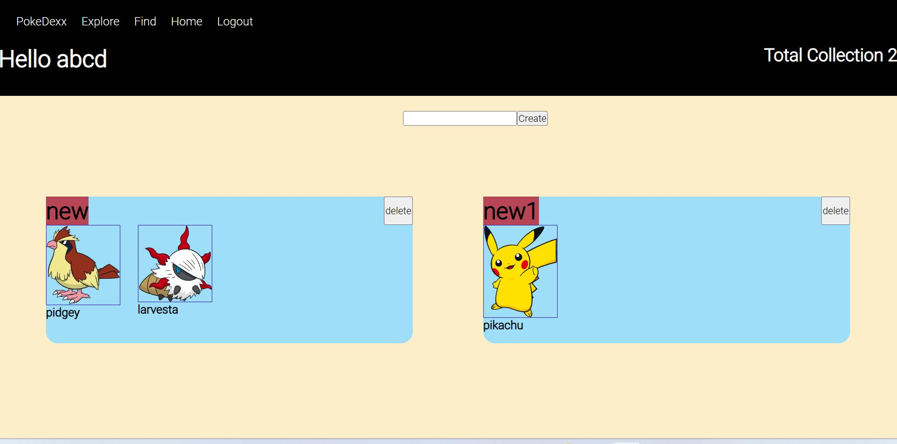
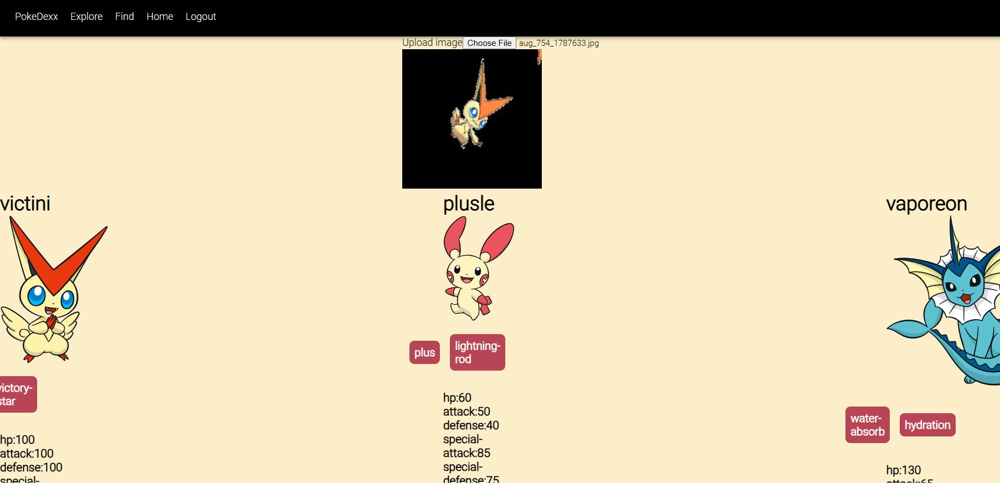

# Pokedex
## Description
It is a MERN Stack application which is integrated with a Deep Learning Model to classify a given pokemon using MobilenetV2 architecture.
User can create a collection of pokemons and add pokemons into that collection from a List of pokemons generated using an API.
User can perform all CRUD operations including removing a pokemon from the collection and deleting a collection.
## Features
### 1) Authentication

### 2) Explore and Search Pokemon

### 3) Add Pokemon to Collections

### 4) Create and Delete Collections

### 4) Find the Pokemon by uploading its image

